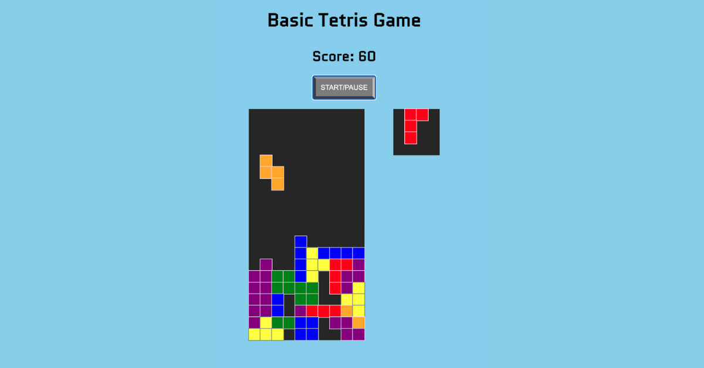

# basic-tetris

> Created a website with Vanilla Javascript, HTML and CSS on which you can play basic Tetris (for desktop).
>
> [Live Demo](https://stefi.codes/basic-tetris/)



## How it works

In order to play click on the Start/Pause button and complete lines by moving differently shaped pieces (tetrominoes), which descend onto the playing field using the arrow keys. The completed lines disappear and grant you 10 points, and you can proceed to fill the vacated spaces. The game ends when the playing field is filled.

## Technologies

Javascript, HTML and CSS.

## Why I've build this game?

I've followed the tutorial by [Ania Kubów](https://twitter.com/ania_kubow) posted on [freecodecamp.com](https://www.freecodecamp.org/news/learn-javascript-by-creating-a-tetris-game/).

Decided to build this game in order to practice manipulating the DOM by using pure JS. Besides practicing JS function it helped me visualize how this whole game is a big array and that I just need to manipulate it.


I've leared how `some()` and `every()` works, how to get a random number within a certain range while using `Math.floor` with `Math.random()` and about `keyCode()` and this cool website [keycode.info](http://keycode.info/) which give you the code of any key you press.

## Install and Play

```
git clone https://github.com/stefi23/basic-tetris.git
open the index.html
play
```
